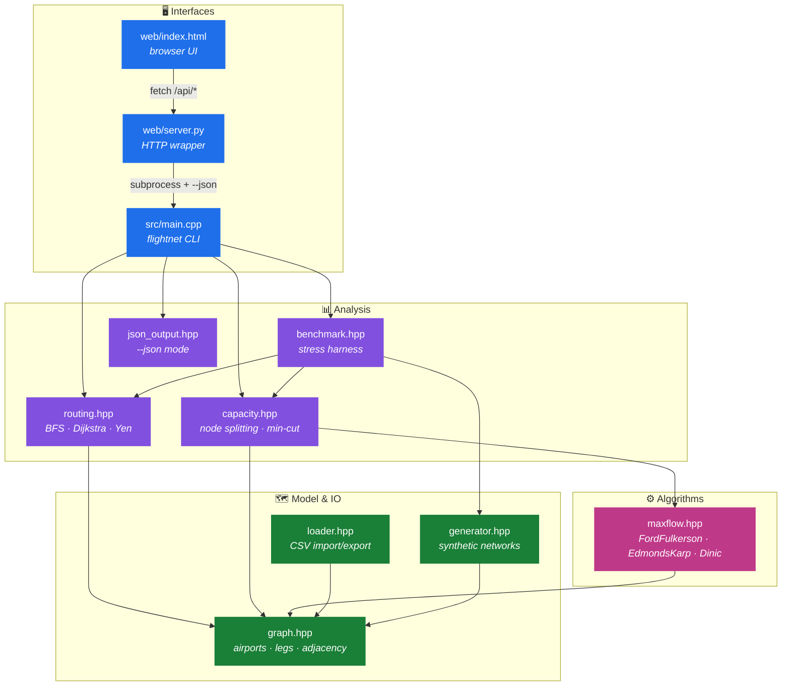
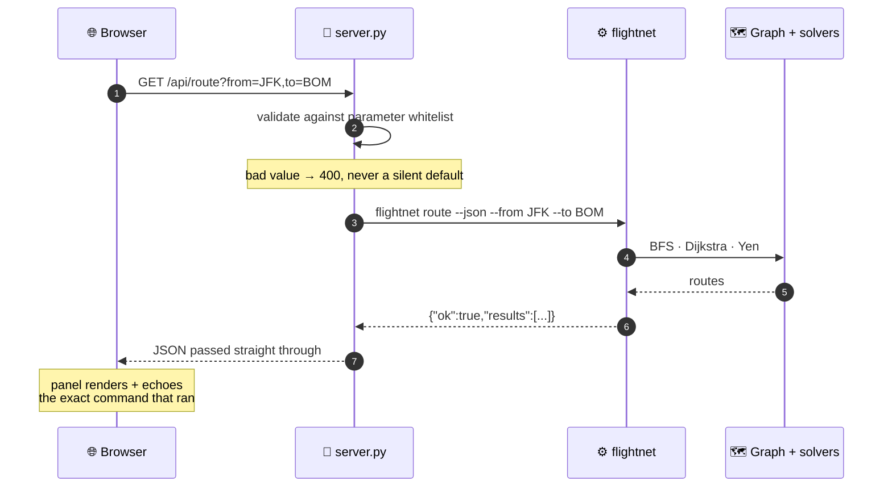
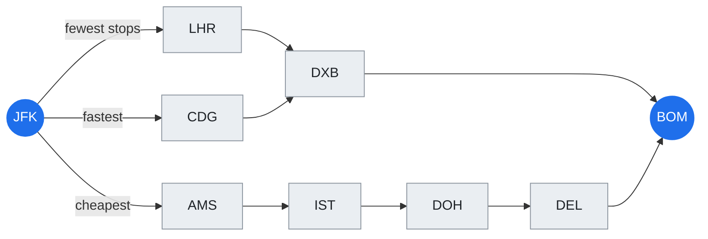
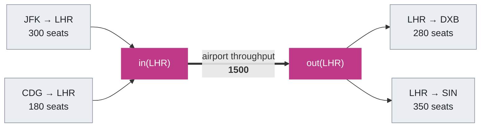
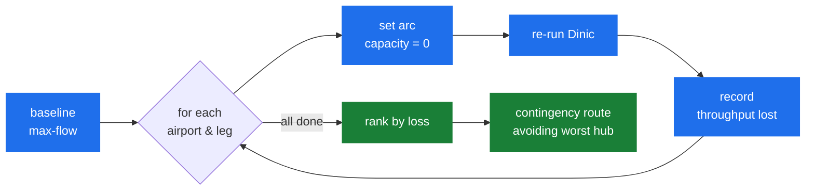
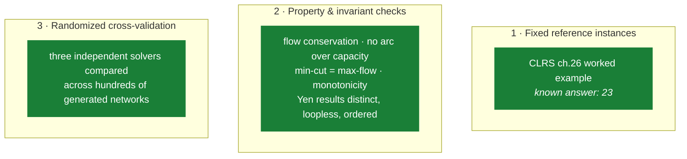

<div align="center">

# ✈️ Flight Network Optimization & Resilience

**A C++ toolkit that treats an airline route map as two graph problems at once —
what should a passenger fly, and what happens when a hub goes down.**


</div>

---

## 🎯 What it does

| | |
|---|---|
| 🧭 **Routing** | Fewest connections (BFS, `O(V+E)`), cheapest fare (Dijkstra, `O(E log V)`), shortest block time, or a weighted trade-off between all three. Yen's algorithm supplies backup itineraries. |
| 🛑 **Capacity & resilience** | How many passengers can actually move between two cities, where the bottleneck is, and what breaks when a hub closes. Maximum flow via **Ford–Fulkerson**, **Edmonds–Karp** and **Dinic**, with airport throughput handled by node splitting. |

Everything is verified against itself rather than against hardcoded answers:
three independent max-flow solvers must agree, their value must equal the
capacity of the minimum cut, and BFS must agree with a unit-weight Dijkstra on
hop counts — checked on **10,000 randomly generated networks** per run.

---

## 🏗️ Architecture



The dependency arrows only ever point downward. `graph.hpp` knows nothing about
routing or flow; `maxflow.hpp` knows nothing about airports. That separation is
what lets the three solvers be swapped underneath the capacity analysis and
cross-checked against each other.

---

## 🚀 Quick start

```sh
make                 # builds build/flightnet and build/flightnet_tests
make test            # 82 unit tests
make run             # guided demo over every feature
make web             # browser UI at http://localhost:8000
```

No dependencies beyond a C++14 compiler. A `CMakeLists.txt` is provided as an
alternative to the `Makefile`.

```sh
build/flightnet route      --data data --from JFK --to BOM
build/flightnet flow       --data data --from LHR --to SYD
build/flightnet resilience --data data --from JFK --to SIN --top 5
build/flightnet bench      --networks 10000 --csv build/bench.csv
```

Run `build/flightnet --help` for the full option list. With no `--data`, the
commands use a bundled 12-airport sample network; `--synthetic` generates one
instead.

---

## 🌐 Browser UI

```sh
make web            # or: python web/server.py
```

Three tabs — routing, max-flow and resilience — plus a network picker for the
curated dataset, the built-in sample, or a synthetic network generated on the
spot.

**The algorithms are deliberately not reimplemented in JavaScript.** The page
drives the same binary a human would:



There is one implementation and it cannot drift. Every result panel prints the
command that produced it, so anything on screen is reproducible in a terminal.

**Security posture:** binds `127.0.0.1` only · invokes the binary through an
argument list, never a shell · four allowed subcommands · every query parameter
whitelisted · `--data` restricted to known dataset directories · static files
confined to `web/`. A parameter that fails validation is **rejected with a 400
rather than dropped** — silently ignoring a malformed origin would answer a
different question than the one asked.

---

## 🧭 What the routing actually does

The three objectives genuinely disagree, which is the whole point of having all
of them. Real output for `JFK → BOM` on the bundled dataset:



| objective | route | legs | fare | time |
|---|---|:--:|--:|--:|
| fewest stops | `JFK → LHR → DXB → BOM` | 3 | 1307 | 17h00m |
| cheapest fare | `JFK → AMS → IST → DOH → DEL → BOM` | 5 | **1271** | 20h40m |
| shortest time | `JFK → CDG → DXB → BOM` | 3 | 1325 | **16h55m** |

Saving 36 units of fare costs two extra connections and nearly four hours. The
`balanced` mode makes that trade-off explicit by minimizing

```
sum over legs of ( w_cost × fare  +  w_time × minutes  +  w_perLeg )
```

`w_perLeg` is the flat price the traveller puts on one more change of plane — it
is what stops a pure cost search from returning absurd nine-leg itineraries. All
three weights are non-negative, which is exactly the condition Dijkstra needs,
and the router **rejects negative weights rather than returning a wrong answer**.

`--alternates N` returns the N best distinct routes using **Yen's algorithm**,
which is what you want when the top result is unavailable.

---

## 🛬 Modelling airport capacity

Max-flow only understands capacity on *edges*, but an airport has its own
ceiling — gates, runway slots, ground handling. The fix is **node splitting**:



Every airport becomes two nodes joined by one arc whose capacity is the
airport's throughput. Any flow through the airport is forced across that arc, so
a node limit becomes an ordinary edge limit.

This also makes failure simulation cheap: **closing an airport is just setting
its throughput arc to zero**, with no graph rebuild. That is what makes ranking
every airport by criticality affordable.

The minimum cut is read straight off the residual graph, and each cut arc is
reported as either a saturated leg or an airport at its ceiling:

```
max flow LHR -> SYD : 800 seats
minimum cut (1 bottleneck, total capacity 800):
  SYD (airport)   capacity 800   <- airport throughput
```

### The resilience sweep



`resilience` ranks airports and legs by throughput lost when each is removed,
and finishes by routing a contingency itinerary that avoids the worst one.

---

## 📈 Benchmark results

Measured on this machine (GCC 6.3, `-O2`, single-threaded), 10,000 synthetic
hub-and-spoke networks averaging 40 airports and 249 legs:

```
-- timings (ms) --
  Ford-Fulkerson   total     321.3 ms   mean 0.0321   p50 0.0184   p99 0.1925
  Dinic            total     124.8 ms   mean 0.0125   p50 0.0115   p99 0.0301
  BFS (min stops)  total      13.8 ms   mean 0.0014   p50 0.0013   p99 0.0032
  Dijkstra (cost)  total      63.5 ms   mean 0.0063   p50 0.0055   p99 0.0224

-- verification --
  solver flow mismatches : 0
  max-flow != min-cut    : 0
  routing violations     : 0
  result                 : PASS
```

### The speedup is a trend, not a constant

Dinic's advantage over Ford–Fulkerson **grows with network size**, so quoting a
single number would be misleading. Ford–Fulkerson augments once per unit of
bottleneck flow; Dinic saturates a whole blocking flow per phase and needs only
`O(V)` phases. From `flightnet bench --scaling --networks 1000`:

| airports | avg V | avg E | FF total | Dinic total | aggregate | median |
|---|--:|--:|--:|--:|--:|--:|
| 10–20   | 15.3  | 67.8   | 3.7 ms    | 4.9 ms   | 0.75× | 0.68× |
| 20–40   | 30.5  | 169.3  | 14.1 ms   | 9.5 ms   | 1.49× | 1.22× |
| 40–80   | 61.0  | 444.2  | 106.5 ms  | 20.4 ms  | **5.23×** | 3.24× |
| 80–160  | 122.0 | 1278.2 | 1214.0 ms | 46.1 ms  | 26.35× | 13.74× |
| 150–300 | 228.7 | 3666.3 | 5173.7 ms | 109.2 ms | 47.37× | 25.26× |

On the smallest networks Dinic is *slower* — its level-graph BFS costs more than
it saves when there is almost nothing to save. Around 40–80 airports, roughly
the size of a regional carrier's map, it is about **5× faster**, and the gap
keeps widening from there. Every rung verifies clean.

Dinic's work profile explains it directly: across the 10,000-network run,
Ford–Fulkerson needed **215,721 augmenting paths** where Dinic needed **27,202
phases**.

### A note on timing

`std::chrono::steady_clock` advertises a nanosecond period but is backed by a
~1 ms system tick on this toolchain — enough to round almost every individual
solve to zero. `include/flightnet/timer.hpp` reads `QueryPerformanceCounter`
directly on Windows (0.1 µs ticks) and falls back to `steady_clock` elsewhere.
The benchmark prints its own timer resolution so the numbers can be sanity
checked against it.

---

## ✅ Testing

```sh
make test                      # all 82 tests
build/flightnet_tests routing  # only tests whose name contains "routing"
```

The suite mixes three kinds of check:



The third is much stronger evidence than any single hand-built case.

### The suite was mutation tested

To confirm the tests are not vacuous, real bugs were injected — each produced
failures:

| injected bug | tests that caught it |
|---|:--:|
| `min` → `max` in the Ford–Fulkerson bottleneck | **19** |
| dropping the reverse-arc update in `push()` | **3** |
| removing the BFS visited guard | **3** |
| making airport throughput unbounded | **3** |

Two mutants survived, and both are genuinely *equivalent* rather than coverage
gaps: relaxing Dinic's admissibility test from `level[v] == level[u]+1` to `>=`
selects the identical arc set (BFS already guarantees `level[v] ≤ level[u]+1`),
and removing the dead-node marking in the blocking-flow retreat only costs time,
since `iter[]` still guarantees forward progress.

---

## 📁 Layout

```
include/flightnet/
  graph.hpp        airports and flight legs; adjacency lists
  routing.hpp      BFS, Dijkstra, multi-objective weights, Yen's k-best
  maxflow.hpp      residual network; Ford-Fulkerson, Edmonds-Karp, Dinic
  capacity.hpp     node splitting, min-cut extraction, resilience ranking
  generator.hpp    reproducible synthetic hub-and-spoke networks
  benchmark.hpp    stress harness and the scaling study
  loader.hpp       CSV import/export, bundled sample network
  json_output.hpp  machine-readable --json mode
  timer.hpp        high-resolution wall clock
src/               implementations plus main.cpp (the CLI)
tests/             82 unit tests and a small self-registering framework
data/              a 30-airport, 132-leg example network
web/               server.py + index.html, the browser front end
scripts/           plot_bench.py, for the --csv output
```

---

## 🔧 Design notes

- **All three solvers share one `FlowNetwork`.** Paired forward/backward arcs
  (`e` and `e ^ 1`) make residual updates a two-line operation, and a common
  representation is what lets the solvers be cross-checked against each other
  and the min-cut be read off afterwards.
- **Ford–Fulkerson and Dinic are both iterative.** A recursive DFS is shorter,
  but a deep residual graph would overflow the stack on the larger stress
  networks — and a crash there is indistinguishable from a wrong answer.
- **The generator is hub-and-spoke, not Erdős–Rényi.** Uniform random graphs put
  the bottleneck nowhere in particular; real route maps concentrate it in a few
  hubs, which is what the capacity model is for. Leg attributes are correlated
  (longer legs cost more and carry bigger aircraft) so the cost-optimal and
  time-optimal routes do not collapse onto each other.
- **Every run is reproducible from its seed**, so a benchmark failure can be
  recreated exactly.
- **C++14 by choice.** The project targets older toolchains; nothing here needs
  a later standard.

---

## 📄 Data format

`data/airports.csv`

```csv
code,city,country,lat,lon,capacity
LHR,London,GB,51.4700,-0.4543,1500
```

`data/routes.csv`

```csv
from,to,cost,duration_min,seats,airline
JFK,LHR,480,420,300,BA
```

`capacity` is aircraft movements per planning window; `0` means "not modelled"
and is treated as unlimited rather than closed. `seats` is the leg capacity used
as the edge capacity for max-flow. Blank lines and `#` comments are ignored, and
a header row is detected automatically. Malformed rows raise a `DataError`
naming the file and line.

Generate a larger network with:

```sh
flightnet generate --airports 80 --out data/synthetic
```
